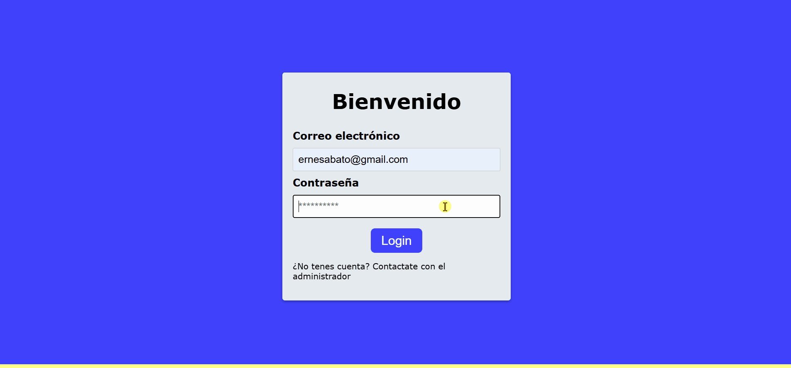
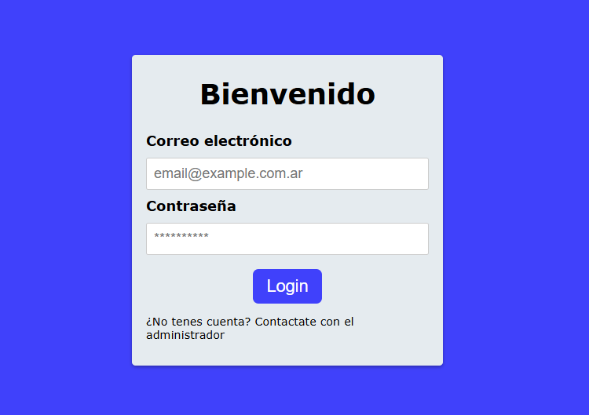
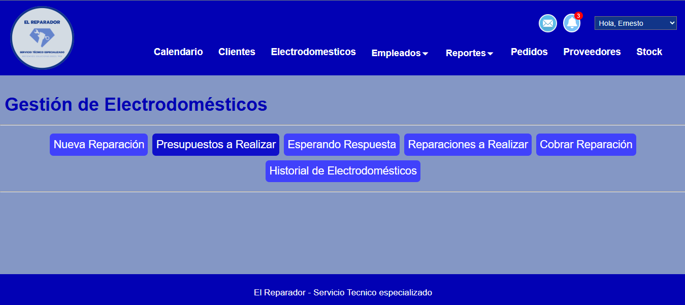
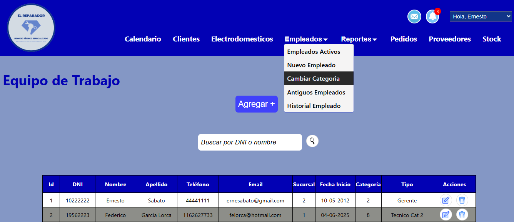
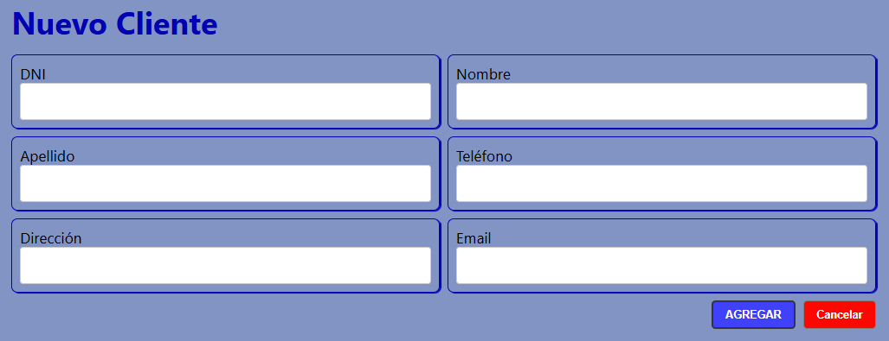
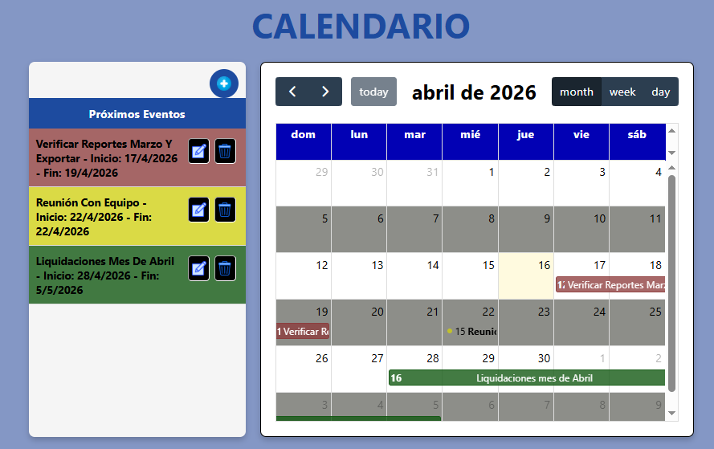

**Read this in other languages:** [Español](README.es.md)

# 🛠️ El Reparador - Management System

## 🎬 Quick Demo


## 💼 About This Project

This project was developed as part of my experience as a Full-Stack Developer, with the goal of designing a complete management system for a real-world repair business.

It reflects my ability to build scalable and modular applications using PHP and MySQL, apply object-oriented programming principles, and design solutions that address practical business needs such as employee management, repair tracking, order and stock management, reporting, and task planning.

Throughout the development process, I focused on writing clean, maintainable code and organizing the system by business domains to ensure clarity and scalability.

---

## 📌 Overview

**El Reparador** is a modular web-based management system designed to handle the daily operations of a repair business.

The application is structured by functional modules, allowing clear separation of responsibilities and easier future expansion.

---

## 💡 Business Context

### Problem
Repair businesses often struggle with:
- Tracking repair status
- Managing client communication
- Handling approvals and scheduling efficiently

### Solution
This system centralizes operations by:
- Automating communication workflows via email
- Managing repair lifecycle from intake to completion
- Different roles and functionalities depending on the type of employee.

---
## 🎬 Full Workflow Demo
End-to-end repair workflow with automated email approvals and notifications.


---
## 📸 Screenshots

### Login System


Secure authentication with restricted access.

---

### Main Dashboard


Centralized view of the system.

---

### Employee Management


Manage employees, categories, and records.

---

### Forms & Data Management


Dynamic forms for creating and updating records.

---

### Calendar & Events


Event tracking with visual alerts based on deadlines.

---


## 🚀 Features

* Modular architecture organized by business domains
* Employee, supplier, and order management
* Product / appliance tracking
* Interactive calendar with event alerts
* PDF / Excel export functionality for reports and data
* Notifications system
* Email integration
* Authentication and protected routes

---

## 🛠️ Tech Stack

**Frontend**

* HTML5
* CSS3
* JavaScript

**Backend**

* PHP (OOP)
* PDO (secure database access)

**Database**

* MySQL

---

## 🧩 Project Structure

```bash
/proyectoElReparador

├── calendario/         # Calendar & events
├── clientes/           # Client management
├── electrodomesticos/  # Appliances / products
├── empleados/          # Employee management
├── fpdf/               # PDF generation library
├── login/              # Authentication system
├── mail/               # Email handling
├── notificaciones/     # Notifications system
├── pedidos/            # Orders management
├── PHPMailer/          # Email library
├── proveedores/        # Supplier management
├── reportes/           # Reports
├── static/             # CSS, JS, and static assets
├── stock/              # Inventory management
│
├── conexionPDO.php     # Database connection
├── cambiarPass.php     # Password management
├── cerrar_sesion.php   # Session handling
├── perfil.php          # User profile
├── perfil_logica.php   # Profile logic
│
├── el_reparador_db.sql # Database schema
├── README.es.md
├── README.md

```
## ⚙️ Installation & Setup

### 🔧 Requirements

* XAMPP
* Apache and MySQL services running

---

### 📥 Installation

1. Clone or download the repository:

```bash
git clone https://github.com/StefiVergini/proyectoElReparador.git
```

2. Move the project into your local server directory:

* Path example:

```
C:/xampp/htdocs/php/proyectoElReparador
```

3. Create a new database in phpMyAdmin:

* Open: http://localhost/phpmyadmin/
* Create database:

```
el_reparador_db
```

4. Import the database:

* Use the file:

```
el_reparador_db.sql
```
---
### 🔐 Environment Variables

This project uses environment variables for sensitive data (e.g., email credentials).

Create a `.env` file in the root directory with the following:


MAIL_USERNAME=your_email@gmail.com

MAIL_PASSWORD=your_app_password


> Make sure this file is not uploaded to GitHub.
---

### ▶️ Running the Project

1. Start Apache and MySQL from XAMPP

2. Open in your browser:

```
http://localhost/php/proyectoElReparador/login/index.php
```

or

```
http://localhost/php/proyectoElReparador/login/login.php
```

---

### 🔐 Test Credentials

You can log in using:

* **Email:** [ernesabato@gmail.com](mailto:ernesabato@gmail.com)
* **Password:** 123hola

> Test credentials for demo purposes
---

### 🧪 Testing Email Functionality (Optional)

To test the email workflow:

- Create a new client account using a valid email address
- Perform actions such as budget approval/rejection
- The system will send automated emails based on the workflow

### ⚠️ Notes

* Make sure Apache and MySQL are running before accessing the system
* Ensure the database is properly imported before logging in
* The project is preconfigured to use the database `el_reparador_db`
* Do not expose real credentials in the repository 
* Use environment variables for sensitive configuration


## 🔐 Authentication

* Login system implemented
* Role-based access (Manager / Repair Technician / Customer Service)
* Protected sections
* New users are assigned a temporary password upon creation
* Users are required to update their password on first login to ensure account security

---

## 📅 Calendar System

* Interactive calendar for scheduling and tracking repairs
* Events generated dynamically based on system actions
* When a budget is approved, the system assigns the repair to the technician's schedule
* Automatically sets start and estimated completion dates
* Helps organize workload and improve task planning
* Visual status indicators:
  - 🔴 Less than 72 hours remaining
  - 🟡 Between 72 and 120 hours
  - 🟢 More than 120 hours

---

## 🔔 Notifications & Email

* Automated email notifications triggered by different workflow events
* Budget emails include action buttons (approve / reject)
* Each action is secured using a single-use token to prevent duplicate submissions
* Upon client action, a confirmation email is automatically sent
* Additional automated emails are sent throughout the repair process (e.g., status updates)
* The system generates internal notifications reflecting key events and client decisions
* Includes appliance ID reference to allow staff to register the outcome in the system
* Event-based triggers ensure timely communication across the repair lifecycle

---

## 💡 Architecture & Design Decisions

* Modular structure organized by business domains (employees, clients, appliances, suppliers, stock, etc.)
* Use of PHP classes in most modules to encapsulate business logic
* PDO used for secure database interaction
* Partial separation between logic and presentation, improving maintainability

---

## Author

**Stefanía Vergini**
Full-Stack Developer

---

## 📬 Contact

stefanialvergini@gmail.com
Open to new opportunities and collaborations.

